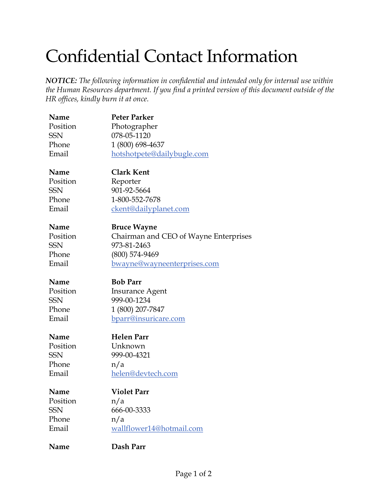
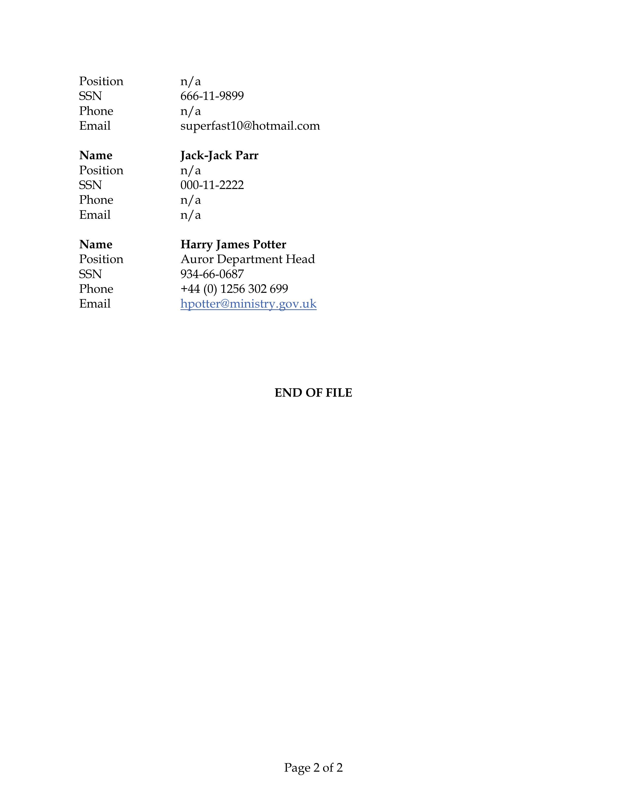
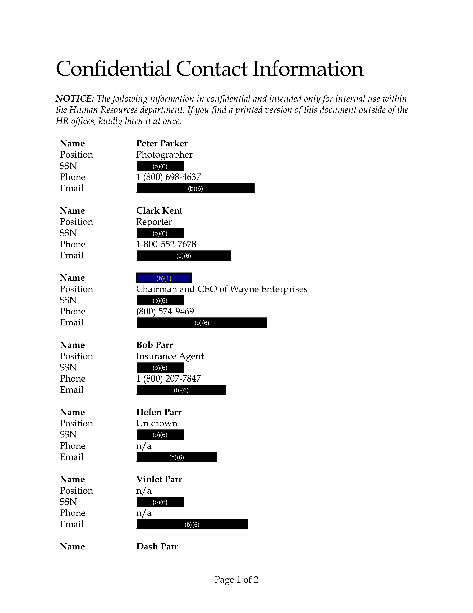
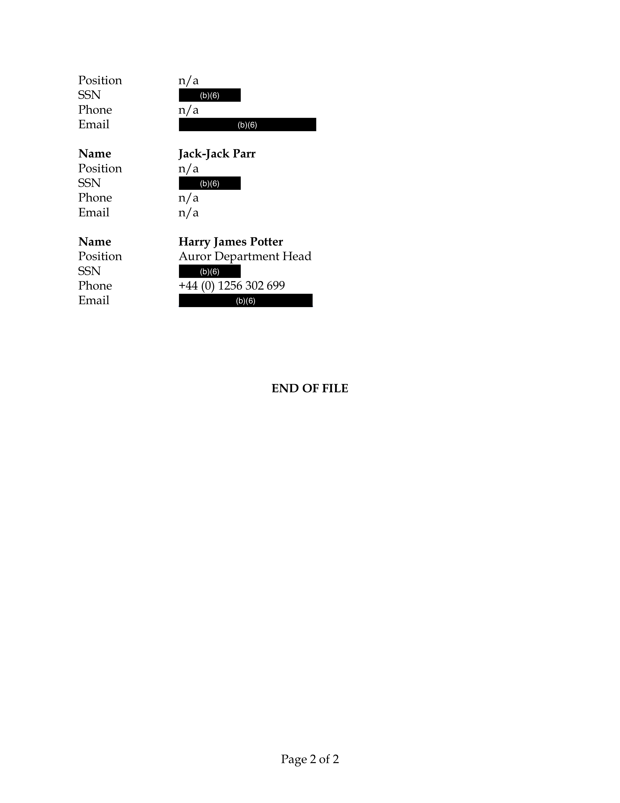

# How to Create a Redacted PDF

With PrizmDoc Server, creating a redacted PDF is a two-step process:

1. First, you must create a markup JSON file which _defines_ the redactions
   which should be applied. There are different ways to do this:

   - A person can _visually and manually_ select regions of text or content to
     be redacted using the PrizmDoc Viewer viewer control in a browser. When
     they save their work, it will be persisted as a [markup JSON] file
     containing all of their redaction definitions.

   - An application can _automatically_ create redaction definitions using
     PrizmDoc Server and a set of regular expressions defining the kinds of text
     in a document that should be redacted. The output of this will be a
     [markup JSON] file containing all of the automatically-generated redaction
     definitions. This is the approach we will take in the guide below.

2. Second, you use PrizmDoc Server to _burn_ the markup JSON into a document,
   producing a new PDF where the content has actually been redacted.

This guide explains how to 1) automatically generate a [markup JSON] file with
redaction definitions for a given document and a set of regular expressions
defining text patterns in that document that should be redacted and 2) burn
the [markup JSON] into the original document, producing a new redacted PDF.

## A Visual Example

### Original Document

For this guide, imagine our original document is a two-page PDF with some
confidential contact information:





### Example Output

Then, imagine we want to redact all Social Security Numbers, email addresses,
and the name "Bruce Wayne" in the original document, producing a redacted PDF
whose pages look like this:





## Step 1: Creating a Markup JSON File Defining What Should Be Redacted

You can use the [CreateRedactionsAsync] method to automatically create a markup
JSON file for a document and a set of regular expression rules defining what
kinds of text should be redacted.

### A Simple Example: Finding the Static Text "John Doe"

First, create a [PrizmDocServerClient]:

```csharp
var prizmDocServer = new PrizmDocServerClient(/* your connection info */);
```

Then, call [CreateRedactionsAsync] providing 1) the source document and 2) a
collection of one or more [RegexRedactionMatchRule] instances which define the
kind of text to search for and, when found, how it should be redacted. The
result of this operation will be a new [RemoteWorkFile] containing the markup
JSON.

Here is a simple example which creates redactions for every occurrence of the
text "John Doe" for a local file `"my-document.docx"`:

```csharp
RemoteWorkFile markupJson = await prizmDocServer.CreateRedactionsAsync("my-document.docx", new[] { new RegexRedactionMatchRule(@"John Doe") });
```

This will upload the file to PrizmDoc Server, ask PrizmDoc Server to create a
new [markup JSON] file containing a redaction definition for every occurrence of
the text `"John Doe"`, and then return once the process is complete.

The returned [RemoteWorkFile] is just _metadata_ about the output [markup JSON]
file; it has not actually been downloaded yet. To download the [markup JSON]
file, call `SaveAsync` on the returned [RemoteWorkFile]:

```csharp
await markupJson.SaveAsync("markup.json");
```

### A More Dynamic Example: Finding Social Security Numbers

Let's say you wanted to create redaction definitions for all occurrences of text
which looked like a Social Security Number. The string you pass in to the
constructor of the [RegexRedactionMatchRule] is actually a regular expression,
so this is easy to achieve, like so:

```csharp
var ssnRule = new RegexRedactionMatchRule(@"\d\d\d-\d\d-\d\d\d\d");
```

You could then use this rule to create the redactions:

```csharp
RemoteWorkFile markupJson = await prizmDocServer.CreateRedactionsAsync("my-document.docx", new[] { ssnRule });
await markupJson.SaveAsync("markup.json");
```

### Using Multiple Rules

Of course, you're not limited to using a single regular expression rule. You can pass in as many different rules as you need, like so:

```csharp
var johnDoeRule = new RegexRedactionMatchRule(@"John Doe");
var ssnRule = new RegexRedactionMatchRule(@"\d\d\d-\d\d-\d\d\d\d");
var emailRule = new RegexRedactionMatchRule(@"\S+@\S+\.\S+");

var rules = new[] { johnDoeRule, ssnRule, emailRule };

RemoteWorkFile markupJson = await prizmDocServer.CreateRedactionsAsync("my-document.docx", rules);
await markupJson.SaveAsync("markup.json");
```

### Customizing Redaction Creation Options

When defining a redaction match rule, you can optionally set the `RedactWith`
property to an instance of [RedactionCreationOptions], allowing you more control
over the appearance of the redactions created by this specific rule.

#### Redaction Reason

It is common to display some sort of phrase in the middle of a redaction box
explaining why the content was redacted. We call this the redaction _reason_,
and you can set it like so:

```csharp
var projectXRule = new RegexRedactionMatchRule(@"Project X")
{
    RedactWith = new RedactionCreationOptions()
    {
        Reason = "CONFIDENTIAL",
    },
};
```

Each rule you define can have its own `Reason`. All redaction definitions
created by that rule will use the same reason text. For example, you might use
different legal codes as the redaction reason for different regular expression
rules:

```csharp
var johnDoeRule = new RegexRedactionMatchRule(@"John Doe")
{
    RedactWith = new RedactionCreationOptions()
    {
        Reason = "(b)(1)",
    },
};

var ssnRule = new RegexRedactionMatchRule(@"\d\d\d-\d\d-\d\d\d\d")
{
    RedactWith = new RedactionCreationOptions()
    {
        Reason = "(b)(6)",
    },
};
```

#### Redaction Appearance

In addition to the `Reason`, the [RedactionCreationOptions] class allows you to set other
properties, such as `FontColor`, `FillColor`, `BorderColor`, and
`BorderThickness`. Here is an example:

```csharp
var bruceWayneRule = new RegexRedactionMatchRule(@"Bruce Wayne")
{
    RedactWith = new RedactionCreationOptions()
    {
        Reason = "(b)(1)",
        FontColor = "#FDE311", // Use "batman yellow" color for the reason text.
        FillColor = "#000080", // Use a dark blue fill color.
        BorderColor = "#000000", // Use pure black border color.
        BorderThickness = 2 // Make the border 2-pixels thick.
    },
};
```

See the [RedactionCreationOptions] class for more information.

#### Attaching Arbitrary Data

Finally, you can use the `Data` property of [RedactionCreationOptions] to define
your own set of key/value string pairs which will be attached to every redaction
definition in the output [markup JSON]. For example, if you define a rule like
this:

```csharp
var johnDoeRule = new RegexRedactionMatchRule(@"John Doe")
{
    RedactWith = new RedactionCreationOptions()
    {
        Data = new Dictionary<string, string>
        {
            { "user-id", "jdoe" },
            { "age", "32" },
        },
    },
};
```

Then, when inspecting the output [markup JSON], you would find that every
redaction created by this rule would contain a `data` property with the given
`user-id` and `age`.

## Step 2: Burning In the Markup, Producing a Redacted PDF

To burn your redactions into a document, simply call [BurnMarkupAsync]
providing 1) the original document and 2) the markup JSON file which defines the
areas to be redacted:

```csharp
RemoteWorkFile result = await prizmDocServer.BurnMarkupAsync("original.pdf", markupJson);
```

This will ask PrizmDoc Server to burn the markup into the document, producing a
new redacted PDF, and then return once the burning process is complete.

The returned result is just _metadata_ about the output; the actual redacted PDF
has not been downloaded yet. To actually download the redacted PDF from PrizmDoc
Server, call `SaveAsync` on the returned result:

```csharp
await result.RemoteWorkFile.SaveAsync("redacted.pdf");
```

Or, if you'd prefer instead to download the bytes to a stream, call
`result.RemoteWorkFile.CopyToAsync`:

```csharp
await result.RemoteWorkFile.CopyToAsync(myStream);
```

## Complete Example

Here is a complete example:

```csharp
using System;
using System.Collections.Generic;
using System.IO;
using System.Threading.Tasks;
using Accusoft.PrizmDocServer;
using Accusoft.PrizmDocServer.Redaction;

namespace Demos
{
    class Program
    {
        static void Main(string[] args)
        {
            MainAsync().GetAwaiter().GetResult();
        }

        static async Task MainAsync()
        {
            var prizmDocServer = new PrizmDocServerClient(/* your connection info */);

            var ssnRule = new RegexRedactionMatchRule(@"\d\d\d-\d\d-\d\d\d\d")
            {
                RedactWith = new RedactionCreationOptions()
                {
                    Reason = "(b)(6)",
                    Data = new Dictionary<string, string>
                    {
                        { "Generated By", "Acme Redactor Application" },
                    },
                },
            };

            var emailRule = new RegexRedactionMatchRule(@"\S+@\S+\.\S+")
            {
                RedactWith = new RedactionCreationOptions()
                {
                    Reason = "(b)(6)",
                    Data = new Dictionary<string, string>
                    {
                        { "Generated By", "Acme Redactor Application" },
                    },
                },
            };

            var bruceWayneRule = new RegexRedactionMatchRule(@"Bruce Wayne")
            {
                RedactWith = new RedactionCreationOptions()
                {
                    Reason = "(b)(1)",
                    FontColor = "#FDE311",
                    FillColor = "#000080",
                    BorderColor = "#000000",
                    BorderThickness = 2,
                    Data = new Dictionary<string, string>
                    {
                        { "Generated By", "Acme Redactor Application" },
                        { "alias", "The Dark Knight" },
                        { "isBatman", "true" },
                    },
                },
            };

            var rules = new[] { ssnRule, emailRule, bruceWayneRule };

            // Automatically create markup JSON using the rules above.
            RemoteWorkFile markupJson = await prizmDocServer.CreateRedactionsAsync("original.pdf", rules);

            // Burn the redactions defined in the markup JSON into the document, producing a new redacted PDF.
            RemoteWorkFile redactedPdf = await prizmDocServer.BurnMarkupAsync("original.pdf", markupJson);

            // Download and save the redacted PDF
            await redactedPdf.SaveAsync("redacted.pdf");
        }
    }
}
```

## Markup JSON Specification

For the full markup JSON specification, see
https://help.accusoft.com/PrizmDoc/latest/HTML/webframe.html#markup-json-specification.html.

<br />
<br />
<br />
<br />
<br />
<br />
<br />
<br />
<br />
<br />
<br />
<br />
<br />
<br />
<br />
<br />
<br />
<br />
<br />
<br />
<br />
<br />
<br />
<br />

[PrizmDocServerClient]: xref:Accusoft.PrizmDocServer.PrizmDocServerClient
[RegexRedactionMatchRule]: xref:Accusoft.PrizmDocServer.Redaction.RegexRedactionMatchRule
[CreateRedactionsAsync]: xref:Accusoft.PrizmDocServer.PrizmDocServerClient.CreateRedactionsAsync(System.String,System.Collections.Generic.IEnumerable{Accusoft.PrizmDocServer.Redaction.RedactionMatchRule})
[RedactionCreationOptions]: xref:Accusoft.PrizmDocServer.Redaction.RedactionCreationOptions
[markup JSON]: #markup-json-specification
[BurnMarkupAsync]: xref:Accusoft.PrizmDocServer.PrizmDocServerClient.BurnMarkupAsync(System.String,System.String)
[RemoteWorkFile]: xref:Accusoft.PrizmDocServer.RemoteWorkFile
